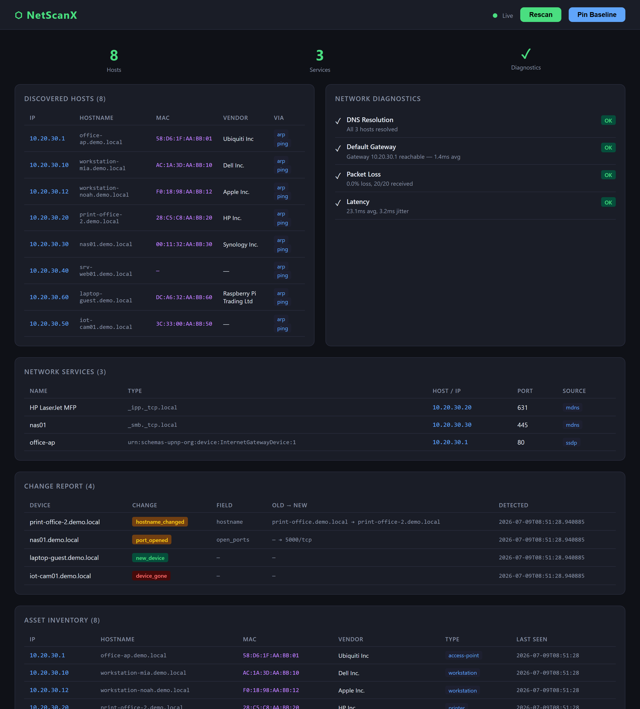

<div align="center">
  

  <h1>NetScanX</h1>
</div>

[English](README.md)

# NetScanX

[](https://github.com/9t29zhmwdh-coder/NetScanX/actions)    

Ein plattformübergreifendes Netzwerk-Discovery- und Diagnose-Toolkit; Hosts entdecken, Dienste aufzählen, Durchsatz messen und Netzwerkprobleme automatisch diagnostizieren, alles über eine einzige CLI.

Läuft auf **macOS, Linux und Windows**. Kein Build-Schritt nötig, Installation via `pip` (siehe [Schnellstart](#schnellstart) für den plattformspezifischen Installationsweg).

<p align="center">
  
</p>

<p align="center"><sub>Der Screenshot zeigt synthetische Demo-Daten, kein echtes Netzwerk.</sub></p>

---

> 🌱 Neu hier? → [Schritt-für-Schritt-Anleitung für Einsteiger](GETTING_STARTED.de.md)

---

## Features

| Modul | Funktion |
|-------|---------|
| **Layer 2** | ARP-Sweep, ARP-Cache-Analyse, MAC-Vendor-Lookup, DHCP-Lease-Parsing |
| **Layer 3** | ICMP-Ping-Sweep, Subnetz-Scan, MTU-Erkennung, IP-Konflikt-Erkennung |
| **Layer 4** | TCP-Connect-Scan, TCP-SYN-Scan¹, UDP-Scan¹, Banner-Grabbing |
| **Services** | mDNS, SSDP/UPnP, NetBIOS, SNMP-Discovery |
| **Performance** | P2P-Speedtest: TCP-Durchsatz, UDP-Paketverlust, Latenz, Jitter |
| **Diagnostics** | DNS-Fehler, doppelte DHCP-Server, Routing-Probleme, Latenz-Spitzen, Subnetz-Fehlkonfiguration |
| **Asset Discovery Plus** | Passive OS-Familie-Schätzung (TTL-Heuristik) und Geräte-Typ-Klassifizierung (Drucker/NAS/Router/AP/Workstation/Server), ohne zusätzliche Netzwerk-Calls |
| **Health Check Engine** | Lokale Maschinen-Gesundheit (Disk/CPU/RAM/Defender/BitLocker/Windows Update) oder leichte netzwerk-beobachtbare Gesundheitssignale (Erreichbarkeit, DNS-Antwortzeit, riskante offene Ports) |
| **Baseline & Drift Detection** | Speichert jeden Scan lokal in SQLite und vergleicht ihn mit dem letzten Scan oder einer gepinnten Baseline: neue/verschwundene Geräte, Port-Änderungen, Hostname-/IP-/MAC-/OS-Änderungen, Service-Änderungen |
| **Dashboard** | Optionales Web-Dashboard (FastAPI + Alpine.js + Chart.js), jetzt mit Change-Report- und Asset-Inventory-Ansicht |
| **Portable Mode** | Einzeldatei-Launcher für Windows/macOS/Linux, lauffähig ab USB-Stick, keine Installation nötig |
| **Output** | Rich-Tabellen (Standard), JSON, YAML für Automatisierung |

¹ Erfordert root/Administrator.

---

## Voraussetzungen

- Python 3.11+ (Windows: von [python.org](https://www.python.org/downloads/windows/) oder aus dem Microsoft Store; macOS/Linux: meist schon vorinstalliert oder über den Paketmanager) — **nur nötig für die per `pip` installierte CLI**, nicht für die portable USB-Version weiter unten
- macOS, Linux oder Windows 10/11

---

## Schnellstart

### macOS / Linux

Die meisten aktuellen Installationen (Homebrew-Python, Debian/Ubuntu-System-Python, …) sind **externally managed** (PEP 668) und blockieren ein direktes `pip install`. Deshalb eine virtuelle Umgebung anlegen:

```bash
python3 -m venv ~/netscanx-venv
source ~/netscanx-venv/bin/activate

pip install git+https://github.com/9t29zhmwdh-coder/NetScanX.git
```

In jeder neuen Shell-Sitzung muss `source ~/netscanx-venv/bin/activate` erneut ausgeführt werden, bevor `netscanx` funktioniert.

<details>
<summary>Ohne venv (nicht empfohlen)</summary>

```bash
pip install --break-system-packages git+https://github.com/9t29zhmwdh-coder/NetScanX.git
```

Das installiert direkt ins System-Python und kann mit Paketen kollidieren, die vom Betriebssystem verwaltet werden.
</details>

### Windows

Erfordert Python 3.11+ von [python.org](https://www.python.org/downloads/windows/) (beim Installer **"Add python.exe to PATH"** ankreuzen) oder aus dem Microsoft Store.

```powershell
py -m pip install git+https://github.com/9t29zhmwdh-coder/NetScanX.git
```

Der `py`-Launcher (Teil des offiziellen Windows-Installers) steht zuverlässiger im `PATH` als ein blosses `pip`/`python`, was die häufigste Ursache für `pip : Die Benennung "pip" wurde nicht als Name eines Cmdlet ... erkannt` ist. Findet sich auch `py` nicht, ist Python entweder nicht installiert oder wurde nicht zum `PATH` hinzugefügt; Installer erneut ausführen und "Ändern" → "Add to PATH" wählen, oder komplett neu von python.org installieren mit gesetzter Checkbox.

Gar kein Python installieren wollen? Den [portablen USB-Launcher](#portable--usb-modus) nutzen: eine einzelne `.exe`, keine Installation, keine PATH-Probleme.

### Lokale Entwicklung (alle Plattformen)

```bash
git clone https://github.com/9t29zhmwdh-coder/NetScanX
cd NetScanX
bash scripts/dev.sh             # Windows: .\scripts\dev.ps1
```

Legt automatisch eine `.venv` an und installiert NetScanX darin editable (siehe [Lokale Entwicklung](#lokale-entwicklung)).

```bash
# Hosts im lokalen Netzwerk entdecken (Subnetz wird automatisch erkannt)
netscanx discover

# Mit Port-Scan und Vendor-Lookup
netscanx discover 192.168.1.0/24 --ports 22,80,443 --vendor

# Netzwerkdienste entdecken (mDNS + SSDP + NetBIOS)
netscanx services

# Diagnose ausführen
netscanx diagnose

# Speedtest zu einem anderen Host (Server dort zuerst starten)
netscanx speedtest --server           # auf Host A
netscanx speedtest 192.168.1.10       # auf Host B

# Web-Dashboard starten
netscanx dashboard
```

---

## CLI-Referenz

### `netscanx discover [TARGET]`

Aktive Hosts via ARP, ICMP-Ping und Port-Scan entdecken.

```
Optionen:
  --arp / --no-arp         ARP-Sweep (root/Admin nötig)  [Standard: an]
  --ping / --no-ping       ICMP-Ping-Sweep               [Standard: an]
  --ports TEXT             Port-Bereich, z. B. 22,80,443 oder 1-1024
  --syn / --no-syn         TCP-SYN-Scan (root/Admin nötig)
  --banner / --no-banner   Service-Banner abrufen
  --vendor / --no-vendor   MAC-Vendor-Lookup (Online-API)
  --hostname / --no-hostname  Hostname per Reverse-DNS auflösen  [Standard: an]
  --timeout FLOAT          Timeout pro Probe in Sekunden [Standard: 2.0]
  --concurrency N          Gleichzeitige Probes          [Standard: 200]
  --format [table|json|yaml]
  -v, --verbose            Port-Details anzeigen
```

```bash
netscanx discover                          # lokales /24 automatisch erkennen
netscanx discover 10.0.0.0/24             # explizites Subnetz
sudo netscanx discover --arp --vendor     # ARP + MAC-Vendor-Lookup
netscanx discover 192.168.1.1 -p 1-65535  # Vollständiger Port-Scan
netscanx discover --format json > hosts.json
```

MAC-Adressen werden nach jedem Ping aus dem ARP-Cache des Betriebssystems gelesen, daher funktionieren `--vendor` und die Hostname-Auflösung auch ohne root. `sudo`/`--arp` ergänzt nur einen rohen ARP-Sweep für Hosts, die nicht auf ICMP antworten.

### `netscanx services [TARGET]`

Netzwerkdienste via Multicast- und Broadcast-Protokolle entdecken.

```
Optionen:
  --mdns / --no-mdns       mDNS/Zeroconf-Suche  [Standard: an]
  --ssdp / --no-ssdp       SSDP/UPnP-Multicast  [Standard: an]
  --netbios / --no-netbios NetBIOS-Name-Scan     [Standard: an]
  --snmp / --no-snmp       SNMP-v2c-System-Info
  --community TEXT         SNMP-Community-String [Standard: public]
  --format [table|json|yaml]
```

```bash
netscanx services
netscanx services 192.168.1.0/24 --snmp
netscanx services --no-netbios --format yaml
```

### `netscanx speedtest [HOST]`

TCP-Durchsatz, UDP-Paketverlust, Latenz und Jitter messen.

```bash
# Zwei-Maschinen P2P-Test:
netscanx speedtest --server              # auf Host A
netscanx speedtest 192.168.1.10         # auf Host B

# Nur Latenz (kein Server nötig):
netscanx speedtest 8.8.8.8 --no-tcp --no-udp --pings 50
```

### `netscanx diagnose`

Automatische Netzwerk-Diagnose.

**Durchgeführte Prüfungen:**
- DNS-Auflösung (google.com, cloudflare.com, github.com)
- Erreichbarkeit und Latenz des Standard-Gateways
- Paketverlust zu 8.8.8.8 (20 Pakete)
- Latenz und Jitter
- Subnetz-Konfiguration (APIPA-Erkennung, Gateway-Subnetz-Konflikt)
- Doppelte DHCP-Server (liest Lease-Dateien)
- IPv6-Konnektivität

### `netscanx dashboard`

Führt beim Start und bei jedem "Rescan" einen Discover-Scan (Hosts, MAC, Vendor, Hostname), einen Services-Scan (mDNS/SSDP) und Diagnostics aus, plus einen Ping/Latenz-Test zu beliebiger IP oder Hostname direkt im Browser.

```bash
netscanx dashboard               # http://localhost:8080
netscanx dashboard --port 9090
```

Das Dashboard bindet standardmässig an `0.0.0.0` und hat keine Authentifizierung, jeder im selben Netzwerk kann darauf zugreifen und Scans/Pings auslösen. Bei Bedarf mit `--host 127.0.0.1` auf localhost beschränken.

### `netscanx baseline`

Führt einen frischen Scan aus und pinnt ihn als Referenz-Baseline für die Drift-Erkennung.

```bash
netscanx baseline --target 10.0.0.0/24
```

### `netscanx changes`

Zeigt, was sich seit dem letzten Scan oder der gepinnten Baseline verändert hat (neue/verschwundene Geräte, Port-Änderungen, Hostname-/IP-/MAC-/OS-Änderungen, Service-Änderungen). Das ist das Herzstück von NetScanX: nicht "welche Geräte gibt es", sondern "was hat sich verändert".

```
Optionen:
  --since-baseline           Alle Änderungen seit der gepinnten Baseline anzeigen
  --since-last                Änderungen seit dem letzten Scan anzeigen  [Standard]
  --format [table|json|yaml]
  --db-path PATH              SQLite-Datenbankpfad überschreiben
```

```bash
netscanx discover --persist          # Scan durchführen und speichern
netscanx changes                     # was hat sich seit dem letzten gespeicherten Scan geändert
netscanx baseline                    # aktuellen Zustand als Referenzpunkt pinnen
netscanx changes --since-baseline    # alles, was sich seit dieser Baseline verändert hat
```

### `netscanx assets`

Listet das gespeicherte Geräte-Inventar auf (jedes je gesehene Gerät, nicht nur der letzte Scan).

```bash
netscanx assets --format json
```

### `netscanx health [TARGET]`

Führt Health-Checks aus. Ohne `TARGET`: Gesundheit der lokalen Maschine (Speicherplatz, CPU, RAM, Windows Defender, BitLocker, Windows Update; die letzten drei nur unter Windows, sonst `skipped`). Mit `TARGET`: leichte netzwerk-beobachtbare Gesundheitssignale (Erreichbarkeit, DNS-Antwortzeit, riskante offene Ports wie Telnet/SMB) für diesen Host, ohne Credentials nötig.

```bash
netscanx health                 # lokale Maschine
netscanx health 192.168.1.10    # ein bestimmter Host im Netzwerk
```

---

## Berechtigungen

| Feature | Linux | macOS | Windows |
|---------|-------|-------|---------|
| TCP-Connect-Scan | kein root | kein root | kein Admin |
| ICMP-Ping (subprocess) | kein root | kein root | kein Admin |
| ARP-Sweep | root / `cap_net_raw` | sudo | Administrator |
| TCP-SYN-Scan | root / `cap_net_raw` | sudo | Administrator |
| UDP-Scan | root | sudo | Administrator |

### Linux; Berechtigung ohne sudo

```bash
sudo setcap cap_net_raw+ep $(which python3)
# oder im venv:
sudo setcap cap_net_raw+ep .venv/bin/python
```

---

## Architektur

```
netscanx/
├── cli/           → Click-Befehle (discover, services, speedtest, diagnose, dashboard,
│                     baseline, changes, assets, health)
├── scanner/       → Layer-2/3/4-Scan-Module + Privilege-Helpers
├── discovery/     → mDNS, SSDP, NetBIOS, SNMP
├── performance/   → P2P-Speedtest Client/Server
├── diagnostics/   → Netzwerk-Health-Checks
├── dashboard/     → FastAPI + Alpine.js + Chart.js Web-UI
├── storage/       → SQLite-Persistenz (SQLAlchemy 2.0 async): Schema, Engine, Repository,
│                     portable-vs-installiert DB-Pfad-Auflösung
├── inventory/     → Geräte-Identitätsauflösung + Drift-Erkennungs-Diff-Logik + Orchestrierung
├── health/        → Health Check Engine (lokal, netzwerk-beobachtbar, Remote-Stub)
├── enrichment/    → Passive OS-/Geräte-Typ-Anreicherung + WMI-Enrichment-Schnittstellen-Stub
├── models.py      → Pydantic-Modelle (Host, Port, ServiceInfo, …)
└── output.py      → Rich / JSON / YAML Formatter

__main__frozen__.py → PyInstaller-Entry-Point für den portablen USB-Launcher
build/               → PyInstaller .spec-Dateien (Windows/macOS/Linux)
```

---

## Portable / USB-Modus

Seit v0.3.0 läuft NetScanX ab einem USB-Stick auf jedem Windows-, macOS- oder Linux-Rechner, ohne Installation. Die Release-Binaries von der [Releases-Seite](https://github.com/9t29zhmwdh-coder/NetScanX/releases) herunterladen und in die Wurzel des Sticks kopieren:

```
USB-Stick-Root/
├── NetScanX-Start-Windows.exe
├── NetScanX-Start-macOS
├── NetScanX-Start-Linux
└── README.txt
```

Auf macOS enthält das Release zusätzlich `NetScanX-Start-macOS.dmg`, ein Disk-Image um dasselbe Binary herum für ein gewohnteres Download-/Mount-Erlebnis. Es ist kein "echter" Installer (es gibt nichts zu installieren, NetScanX bleibt portabel) und zeigt dieselbe Gatekeeper-Warnung wie das rohe Binary.

Ein Doppelklick auf ein Binary ohne Argumente startet das Dashboard und öffnet den Browser, analog zu `netscanx dashboard`. Ein Aufruf aus dem Terminal mit Argumenten bietet die volle CLI (`NetScanX-Start-Windows.exe discover --arp` usw.). Beim ersten Start entsteht ein `NetScanX-Data/`-Ordner neben dem Binary mit der SQLite-Datenbank. So wandert die Scan-Historie und die Baselines mit dem Stick über verschiedene Rechner. Bei Bedarf mit `--db-path` oder `NETSCANX_DB_PATH` überschreiben.

Der portable Modus läuft standardmässig unprivilegiert auf fremden Rechnern, genau wie der Non-Root-Fallback der regulären CLI (siehe [Berechtigungen](#berechtigungen) unten).

**Bekannte Einschränkungen:**
- **Windows:** Die `.exe` ist mit einem selbstsignierten Zertifikat signiert (nicht von einer vertrauenswürdigen CA), löst deshalb weiterhin eine SmartScreen-Warnung aus ("Windows hat den PC geschützt"). Die Signatur garantiert nur, dass die Datei nach dem Signieren nicht verändert wurde, sie stellt kein Herausgeber-Vertrauen her. Auf "Weitere Informationen" → "Trotzdem ausführen" klicken. Eine CA-signierte Version ist eine mögliche zukünftige Verbesserung, siehe [ROADMAP.md](ROADMAP.md).
- **macOS:** Das Binary und die `.dmg` sind unsigniert und lösen beim ersten Start einen Gatekeeper-Block ("nicht verifizierter Entwickler") aus. Rechtsklick auf die Datei → "Öffnen", um das einmalig zu umgehen.
- **Linux:** FAT32/exFAT-formatierte USB-Sticks bewahren das Unix-Ausführbar-Bit nicht, daher startet das Binary per Doppelklick eventuell nicht. Zuerst `chmod +x NetScanX-Start-Linux` ausführen, oder im Dateimanager "Als Programm ausführen" wählen.

---

## Ausgabeformate

Alle Befehle unterstützen `--format [table|json|yaml]`:

```bash
netscanx discover --format json > scan.json
netscanx diagnose --format yaml
netscanx diagnose --format json | python3 -c "import sys,json; d=json.load(sys.stdin); [print(c['name'],c['status']) for c in d['checks']]"
```

---

## Lokale Entwicklung

```bash
# Linux / macOS
bash scripts/dev.sh

# Windows (PowerShell)
.\scripts\dev.ps1

# Netzwerkdienste lokal simulieren (kein echtes Netz nötig)
python tools/test_network.py
netscanx discover 127.0.0.1 --no-arp --ping --ports 22,80,443,8080
```


---

**Autor:** [Rafael Yilmaz](https://github.com/9t29zhmwdh-coder) · **Status:** Active ·  · **Lizenz:** MIT

